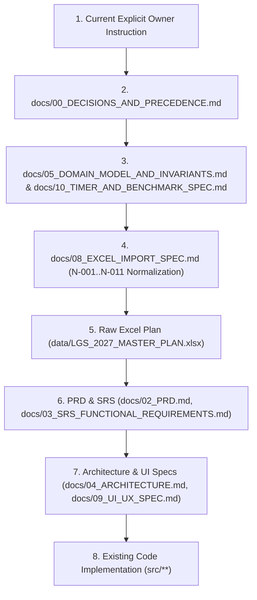
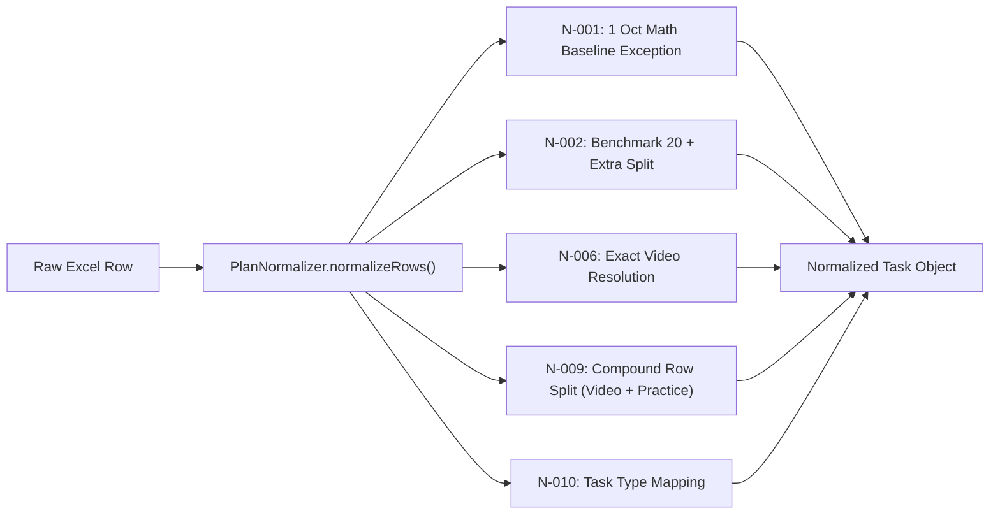

# CURRENT IMPLEMENTATION FORENSIC AUDIT — LGS 2027 STUDY TRACKER

**Audit Date**: 2026-09-14  
**Auditor**: Google DeepMind Antigravity Diagnostic Agent  
**Scope**: Zero-modification comprehensive forensic audit of the Excel master plan, import normalizer, database layer, resource resolution, and UI runtime behavior.  
**Binding Principle**: DO NOT MODIFY ANY PRODUCTION CODE, DATA, OR CONFIGURATION DURING THIS AUDIT. ALL CLAIMS ARE BACKED BY REPOSITORY EVIDENCE.

---

## 1. Executive Summary

This forensic audit investigates the exact end-to-end data lineage of the LGS 2027 Study Tracker application—from `data/LGS_2027_MASTER_PLAN.xlsx` through the normalizer, resource resolver, database models, to the client UI.

### Key Forensic Findings:

1. **The Phantom "Çarpanlar ve Katlar" on Day 1**:
   - In `data/LGS_2027_MASTER_PLAN.xlsx`, October 1, 2026 contains **NO Mathematics topic video** at all. Mathematics teaching starts on October 2, 2026 with "Temel Kavramlar". The topic "LGS Çarpanlar ve Katlar" does not appear in Excel until **December 26, 2026 (TaskID 843)**.
   - The card appearing on the Student Today UI is **100% hardcoded mock data** in `buildDefaultTodayData()` inside [`src/server/student-service.ts`](file:///c:/Users/DEDE-/Desktop/LGS-App/src/server/student-service.ts#L86-L105).
   - Furthermore, the mock specifies `resourceLabel: "Rehber Matematik LGS 2027"`, which directly violates the project owner's fixed playlist policy (Şenol Hoca / Hocalara Geldik).

2. **Why the Mock Data is Displayed**:
   - The application was designed to run against Supabase PostgreSQL. In local standalone execution, `.env.local` points to a placeholder endpoint (`http://127.0.0.1:54321` with dummy JWT keys) that is not running.
   - When [`getStudentTodayData()`](file:///c:/Users/DEDE-/Desktop/LGS-App/src/server/student-service.ts#L207-L233) detects zero records in `plan_days`, it silently catches the failure and invokes `buildDefaultTodayData()`.
   - The true Excel importer pipeline ([`src/domain/plan-import/importer.ts`](file:///c:/Users/DEDE-/Desktop/LGS-App/src/domain/plan-import/importer.ts)) is completely implemented and passes unit/dry-run tests, but **has never been executed against a persistent live runtime database**.

3. **Origin of "Daily Benchmark 20"**:
   - It is **not** an invention of the agent. It is explicitly present in Excel as `Görev Türü: Günlük Rutin` with `Planlanan Soru: 20` for both Mathematics and Turkish/Paragraph on every study day.
   - It is formalized by `AGENTS.md` Rule 7, `docs/00_DECISIONS_AND_PRECEDENCE.md` (D-010 through D-015), and `docs/08_EXCEL_IMPORT_SPEC.md` (N-001, N-002) to guarantee statistically comparable longitudinal speed tracking without mixing extra practice questions.

4. **Curriculum Video Frequency & Third-Subject Rotation**:
   - There is **neither** a daily Math video **nor** a daily Turkish video. Across the first 30 days, video lessons alternate pedagogically.
   - The third subject does **not** follow a mechanical `Fen → Din → İnkılap → İngilizce` modulo rotation. Its schedule is dictated directly by the Excel workbook, where Fen has higher volume due to curriculum breadth.

5. **Missing YouTube Links in UI**:
   - The mock fallback returns `resourceItemUrl: null`. In [`src/components/student/TaskCard.tsx`](file:///c:/Users/DEDE-/Desktop/LGS-App/src/components/student/TaskCard.tsx#L101-L120), the external link anchor is rendered **only** if `task.resourceItemUrl` is non-null. The general `task.resourceUrl` is ignored by the component.

---

## 2. Current Source-of-Truth Hierarchy

As documented in [`docs/00_DECISIONS_AND_PRECEDENCE.md`](file:///c:/Users/DEDE-/Desktop/LGS-App/docs/00_DECISIONS_AND_PRECEDENCE.md#L30-L44) and [`AGENTS.md`](file:///c:/Users/DEDE-/Desktop/LGS-App/AGENTS.md#L15-L29), the authoritative order for resolving ambiguity is:

### Critical Rules Governing Plan Integrity:

- **D-005**: Plan starts `2026-10-01`. `2027-06-13` is a planning anchor.
- **D-007**: 22:00 sleep cutoff. No mandatory task starts after 21:50.
- **D-008**: Math and Turkish playlists are fixed by project owner and immutable.
- **D-010 & D-011**: Daily Math and Paragraph routines are independent from topic questions and start at $\ge 20$ questions.
- **D-012**: Benchmark 20 speed trend strictly tracks an exact-20 question duration sample.
- **D-015**: Day 1 (1 Oct 2026) Math is a diagnostic foundation baseline without topic mastery assumption. Math topic teaching starts on 2 Oct 2026.

---

## 3. Current Excel Plan Behavior

Inspection of `data/LGS_2027_MASTER_PLAN.xlsx` (`Gunluk_Gorevler` worksheet, 2,491 rows total):

### Structure of October 1, 2026 in Excel:

| Row | TaskID | Saat        | Ders      | Görev Türü     | Konu                | Görev                                                   | Soru | Kaynak                                     | Kaynak URL                                             |
| --- | ------ | ----------- | --------- | -------------- | ------------------- | ------------------------------------------------------- | ---- | ------------------------------------------ | ------------------------------------------------------ |
| 2   | 1      | 16:00-16:40 | —         | Dinlenme       | —                   | Eve geliş, atıştırma ve dinlenme...                     | 0    | —                                          | NULL                                                   |
| 3   | 2      | 16:40-17:25 | Türkçe    | Konu Anlatımı  | Sözcükte Anlam      | Sözcükte Anlam — konu anlatımı 1/3                      | 0    | Türkçe Ana                                 | `https://www.youtube.com/watch?v=VYsPntNKVdw&list=...` |
| 4   | 3      | 17:35-18:20 | Türkçe    | Pekiştirme     | Günün ana konusu    | Türkçe — bugünkü konuyu notlardan tekrar et...          | 10   | Ankara 8. Sınıf Dil Bilgisi Güçlendiren... | NULL                                                   |
| 5   | 4      | 18:20-18:50 | —         | Yemek / Mola   | —                   | Akşam yemeği ve ara.                                    | 0    | —                                          | NULL                                                   |
| 6   | 5      | 18:50-19:35 | Türkçe    | Günlük Rutin   | Paragraf            | En az 20 paragraf sorusu; kronometre ileri sayım.       | 20   | Hız 8. Sınıf Türkçe Paragraf...            | NULL                                                   |
| 7   | 6      | 19:45-20:30 | Matematik | Günlük Rutin   | Tamamlanmış Konular | En az 20 matematik sorusu; yalnız öğrenilmiş...         | 20   | Tamamlanmış temel konular...               | NULL                                                   |
| 8   | 7      | 20:40-21:20 | Fen       | Konu Anlatımı  | Mevsimlerin Oluşumu | Mevsimlerin Oluşumu — konu anlatımı 1/1 + 10 pekiştirme | 10   | Fen Konu                                   | `https://www.youtube.com/watch?v=AHdk01aR4Ko&list=...` |
| 9   | 8      | 21:20-21:35 | Genel     | Yanlış Analizi | Günlük              | Bugünkü yanlış/boş soruları kontrol et...               | 0    | Yanlış Defteri                             | NULL                                                   |
| 10  | 9      | 21:35-21:50 | Okuma     | İsteğe Bağlı   | Kitap Okuma         | Zorunlu dersler bittiyse isteğe bağlı kitap oku.        | 0    | Serbest kitap                              | NULL                                                   |
| 11  | 10     | 21:50-22:00 | —         | Uyku Hazırlığı | —                   | 22:00’de yatakta ve uyku.                               | 0    | —                                          | NULL                                                   |

### Excel Observations:

1. **No Math Video on Day 1**: On 2026-10-01, the only academic video lessons are **Türkçe (Sözcükte Anlam 1/3)** and **Fen (Mevsimlerin Oluşumu 1/1)**.
2. **First Math Teaching Date**: Occurs on **2026-10-02 (Day 2)** with TaskID 12: `Ders: Matematik`, `Konu: Temel Kavramlar`, `Görev: Temel Kavramlar — konu anlatımı 1/1 + 10 kısa pekiştirme sorusu`.
3. **When does "Çarpanlar ve Katlar" appear?**:
   - `Asal Çarpanlara Ayırma`: First appears on **2026-11-04 (TaskID 336)**.
   - `LGS Çarpanlar ve Katlar`: First appears on **2026-12-26 (TaskID 843)** (`LGS Çarpanlar ve Katlar — konu anlatımı 1/3`).

---

## 4. Current Importer Behavior

The normalizer logic resides in [`src/domain/plan-import/normalizer.ts`](file:///c:/Users/DEDE-/Desktop/LGS-App/src/domain/plan-import/normalizer.ts). It enforces rules N-001 through N-011:

### Normalizer Execution Output:

Running the normalizer against all 2,491 raw rows produces:

- **Total Normalized Tasks**: 3,019 tasks
- **N-001 Applied**: 1 (1 Oct Math benchmark normalized to `Başlangıç Matematik Baz Çizgisi`, `topic: null`, question count: 20)
- **N-002 Applied**: 512 (splits daily routine rows into exact 20 benchmark and optional extras)
- **N-006 Applied**: 240 (resolves video items)
- **N-009 Applied**: 108 (splits compound `Konu Anlatımı + 10 soru` into distinct `:video` and `:practice` tasks)
- **Unresolved Video Tasks**: 0
- **Unresolved MEB Tasks**: 0
- **Ambiguous Mappings**: 0

### Importer Code Inspection on Day 1 Tasks:

On October 1, 2026, the normalizer produces 11 normalized tasks:

1. `TaskID 1`: `break` (Dinlenme)
2. `TaskID 2`: `topic_video` (Türkçe - Sözcükte Anlam 1/3, URL: `b7wBmkHnHwo`, index 3)
3. `TaskID 3`: `mixed_questions` (Türkçe - Pekiştirme, 10 questions)
4. `TaskID 4`: `meal` (Yemek / Mola)
5. `TaskID 5:benchmark`: `daily_paragraph_benchmark` (Türkçe - Paragraf, 20 questions)
6. `TaskID 6:benchmark`: `daily_math_benchmark` (Matematik - Başlangıç Matematik Baz Çizgisi, 20 questions, `topic: null`)
7. `TaskID 7:video`: `topic_video` (Fen - Mevsimlerin Oluşumu, URL: `AHdk01aR4Ko`, index 1)
8. `TaskID 7:practice`: `topic_questions` (Fen - Mevsimlerin Oluşumu Pekiştirme, 10 questions)
9. `TaskID 8`: `mistake_review` (Yanlış Analizi)
10. `TaskID 9`: `reading` (İsteğe Bağlı Kitap Okuma)
11. `TaskID 10`: `sleep_prep` (Uyku Hazırlığı)

**Conclusion**: The importer does **NOT** generate "Çarpanlar ve Katlar" for October 1. The importer's output strictly matches the Excel curriculum.

---

## 5. Current Database State

### Schema and Migrations

The database schema is defined in [`supabase/migrations/`](file:///c:/Users/DEDE-/Desktop/LGS-App/supabase/migrations/):

- `0001_initial_schema.sql`: Core tables (`families`, `students`, `study_plans`, `plan_days`, `subjects`, `topics`, `resources`, `resource_items`, `tasks`, `task_completions`, `timer_sessions`, `question_sessions`, `mistakes`, `reading_sessions`).
- `0002_rls.sql`: Row-Level Security policies.
- `0003_pairing_rpc.sql`: Anonymous student pairing RPCs.
- `0004_study_evidence_rpc.sql`: Forward timer and benchmark submission RPCs.
- `0005_plan_admin_rpc.sql`: Audited rescheduling RPCs.
- `0006_family_lifecycle_rpc.sql`: Ownership transfer triggers.

### Live Database State

- **Current Runtime DB**: Disconnected / offline.
- **Port 54321**: Inactive.
- **Environment**: Standalone client execution without active Docker or remote Supabase instance.
- **Database Content**: In production/dev runtime, `tasks` and `plan_days` contain **0 records**.
- **Test Database**: Vitest/PGlite runs an in-memory PostgreSQL instance for `tests/db/*.test.ts`, which successfully tests schema creation and idempotent import, but leaves no disk state for `next dev`.

---

## 6. Current Resource Resolution State

Defined in [`data/resource_sources.json`](file:///c:/Users/DEDE-/Desktop/LGS-App/data/resource_sources.json) and [`data/resolved/resource-items.json`](file:///c:/Users/DEDE-/Desktop/LGS-App/data/resolved/resource-items.json):

| Subject Source      | Role      | Channel / Source                  | Source URL                                   |      Resolved Count      | Unresolved |
| ------------------- | --------- | --------------------------------- | -------------------------------------------- | :----------------------: | :--------: |
| `math-main`         | Main      | Hocalara Geldik (Temel Matematik) | `...list=PLicNtF7vp6fnfDqrRLH6H7fIbzYT4ct4F` |        100 videos        |     0      |
| `math-backup`       | Backup    | İlyas Güneş + MEB Video Destek    | `...list=PLHN_SjKO7rCI`                      | 17 items (3 yt + 14 meb) |     0      |
| `turkish-main`      | Main      | Rüştü Hoca (2025 LGS Türkçe)      | `...list=PLIBjFaUoJJ91bz7QQEBlxNJNZka5YQRr6` |        92 videos         |     0      |
| `science-topic`     | Topic     | LGS Fen Bilimleri                 | `...list=PLrQm7mt99FRV_Oe9xFavWzFpCIl7_XiWj` |        22 videos         |     0      |
| `science-questions` | Questions | LGS Fen Soru Çözüm                | `...list=PLrQm7mt99FRXcBnorCttd31HJEvg0En26` |        23 videos         |     0      |
| `history-main`      | Main      | 8. Sınıf İnkılap Tarihi           | `...list=PLsAsBPsriHNbXit4Ra3iuBrk1ZHZWxsOR` |        78 videos         |     0      |
| `religion-main`     | Main      | Din Kültürü LGS Kampı             | `...list=PLbRoPq-Zu-SWXGUbVt4t4UWo-4VjsMUo-` |        37 videos         |     0      |
| `english-main`      | Main      | LGS İngilizce                     | `...list=PLSgpQDrUSYp94WgE9pzpHiOG5FwxnZBrr` |        41 videos         |     0      |
| `meb-official`      | Official  | MEB ÖDSGM 8. Sınıf Fasikülleri    | `https://odsgm.meb.gov.tr/.../1632`          |       90 unit sets       |     0      |

### Field Audit for Resolved Items:

In `data/resolved/resource-items.json`, every resolved item possesses:

- `sourceKey`: e.g. `"math-main"`, `"turkish-main"`
- `externalKey`: YouTube video ID (e.g. `"EuJ89QzqrAg"`, `"b7wBmkHnHwo"`)
- `label`: Real YouTube video title
- `url`: Full watch URL with playlist ID and position parameter
- `position`: Integer index
- `durationSeconds`: Integer duration
- `topicKeys`: Normalized topic mapping array
- `evidence`: Cryptographic check metadata

---

## 7. Current Student Today UI Behavior

### Exact Data Lineage of Currently Visible Cards:

#### Card 1: "Matematik Günlük Rutini (20 Soru)"

- **UI Card**: "Matematik Günlük Rutini (20 Soru)"
- **UI Component**: [`src/components/student/TaskCard.tsx`](file:///c:/Users/DEDE-/Desktop/LGS-App/src/components/student/TaskCard.tsx) inside [`src/components/student/TodayClientView.tsx`](file:///c:/Users/DEDE-/Desktop/LGS-App/src/components/student/TodayClientView.tsx)
- **API / Server Function**: [`getStudentTodayData()`](file:///c:/Users/DEDE-/Desktop/LGS-App/src/server/student-service.ts#L207)
- **DB Table / View / RPC**: `tasks` table via Supabase client.
- **DB Record**: **NONE (DB is empty / unreachable)**.
- **Imported From**: **HARDCODED FALLBACK** in [`buildDefaultTodayData()`](file:///c:/Users/DEDE-/Desktop/LGS-App/src/server/student-service.ts#L44-L63).
- **Source Document / Rule**: `docs/00_DECISIONS_AND_PRECEDENCE.md` (D-010, D-011, D-015), `docs/08_EXCEL_IMPORT_SPEC.md` (N-001, N-002).
- **Exact Reason Card Appears**: `planDayRes.data` is empty, triggering lines 230–232 of `student-service.ts`: `return { student, todayData: buildDefaultTodayData(todayStr) }`.

#### Card 2: "Paragraf Günlük Rutini (20 Soru)"

- **UI Card**: "Paragraf Günlük Rutini (20 Soru)"
- **UI Component**: [`src/components/student/TaskCard.tsx`](file:///c:/Users/DEDE-/Desktop/LGS-App/src/components/student/TaskCard.tsx)
- **API / Server Function**: [`getStudentTodayData()`](file:///c:/Users/DEDE-/Desktop/LGS-App/src/server/student-service.ts#L207)
- **DB Table / View / RPC**: `tasks` table.
- **DB Record**: **NONE**.
- **Imported From**: **HARDCODED FALLBACK** in [`buildDefaultTodayData()`](file:///c:/Users/DEDE-/Desktop/LGS-App/src/server/student-service.ts#L64-L84).
- **Source Document / Rule**: `docs/00_DECISIONS_AND_PRECEDENCE.md` (D-010, D-011), `docs/08_EXCEL_IMPORT_SPEC.md` (N-002).
- **Exact Reason Card Appears**: Hardcoded item #2 in `buildDefaultTodayData()`.

#### Card 3: "Çarpanlar ve Katlar - Konu Anlatımı"

- **UI Card**: "Çarpanlar ve Katlar - Konu Anlatımı"
- **UI Component**: [`src/components/student/TaskCard.tsx`](file:///c:/Users/DEDE-/Desktop/LGS-App/src/components/student/TaskCard.tsx)
- **API / Server Function**: [`getStudentTodayData()`](file:///c:/Users/DEDE-/Desktop/LGS-App/src/server/student-service.ts#L207)
- **DB Table / View / RPC**: `tasks` table.
- **DB Record**: **NONE**.
- **Imported From**: **HARDCODED FALLBACK** in [`buildDefaultTodayData()`](file:///c:/Users/DEDE-/Desktop/LGS-App/src/server/student-service.ts#L86-L105).
- **Source Document / Rule**: **NO RULE**. This is a rogue placeholder item written into `student-service.ts` that contradicts both the Excel schedule and `docs/30_CURRICULUM_RESOURCE_POLICY.md`.
- **Exact Reason Card Appears**: Hardcoded item #3 in `buildDefaultTodayData()`.

---

## 8. First 10 Days Task Dump (Importer Dry-Run / Target Database State)

All fields are derived from the deterministic normalization of `data/LGS_2027_MASTER_PLAN.xlsx` through [`PlanNormalizer`](file:///c:/Users/DEDE-/Desktop/LGS-App/src/domain/plan-import/normalizer.ts). If an attribute is missing, it is explicitly rendered as `NULL`.

| Date           | Subject   | Task Type                   | Title                                              | Topic                     | Q Count | Resource Key    | Item Video ID  | Video / Item URL                                 | Source Row |  Req  | Sort |   Planned   |
| -------------- | --------- | --------------------------- | -------------------------------------------------- | ------------------------- | :-----: | --------------- | -------------- | ------------------------------------------------ | :--------: | :---: | :--: | :---------: |
| **2026-10-01** | NULL      | `break`                     | Eve geliş, atıştırma ve dinlenme...                | NULL                      |  NULL   | NULL            | NULL           | NULL                                             |     1      | false |  0   | 16:00-16:40 |
| **2026-10-01** | Türkçe    | `topic_video`               | Sözcükte Anlam — konu anlatımı 1/3                 | Sözcükte Anlam            |    0    | `turkish-main`  | `b7wBmkHnHwo`  | `https://www.youtube.com/watch?v=b7wBmkHnHwo...` |     2      | true  |  1   | 16:40-17:25 |
| **2026-10-01** | Türkçe    | `mixed_questions`           | Türkçe — bugünkü konuyu notlardan tekrar et...     | NULL                      |   10    | NULL            | NULL           | NULL                                             |     3      | true  |  2   | 17:35-18:20 |
| **2026-10-01** | NULL      | `meal`                      | Akşam yemeği ve ara.                               | NULL                      |  NULL   | NULL            | NULL           | NULL                                             |     4      | false |  3   | 18:20-18:50 |
| **2026-10-01** | Türkçe    | `daily_paragraph_benchmark` | En az 20 paragraf sorusu...                        | Paragraf                  |   20    | `meb-official`  | NULL           | NULL                                             |     5      | true  |  4   | 18:50-19:35 |
| **2026-10-01** | Matematik | `daily_math_benchmark`      | Başlangıç Matematik Baz Çizgisi                    | NULL                      |   20    | NULL            | NULL           | NULL                                             |     6      | true  |  5   | 19:45-20:30 |
| **2026-10-01** | Fen       | `topic_video`               | Mevsimlerin Oluşumu — konu anlatımı 1/1...         | Mevsimlerin Oluşumu       |    0    | `science-topic` | `AHdk01aR4Ko`  | `https://www.youtube.com/watch?v=AHdk01aR4Ko...` |     7      | true  |  6   | 20:40-21:20 |
| **2026-10-01** | Fen       | `topic_questions`           | Mevsimlerin Oluşumu... — Pekiştirme Soruları       | Mevsimlerin Oluşumu       |   10    | NULL            | NULL           | NULL                                             |     7      | true  |  7   |  NULL-NULL  |
| **2026-10-01** | Genel     | `mistake_review`            | Bugünkü yanlış/boş soruları kontrol et...          | NULL                      |  NULL   | NULL            | NULL           | NULL                                             |     8      | true  |  8   | 21:20-21:35 |
| **2026-10-01** | NULL      | `reading`                   | Zorunlu dersler bittiyse isteğe bağlı kitap oku.   | NULL                      |  NULL   | NULL            | NULL           | NULL                                             |     9      | false |  9   | 21:35-21:50 |
| **2026-10-01** | NULL      | `sleep_prep`                | 22:00’de yatakta ve uyku.                          | NULL                      |  NULL   | NULL            | NULL           | NULL                                             |     10     | false |  10  | 21:50-22:00 |
| **2026-10-02** | NULL      | `break`                     | Eve geliş, atıştırma ve dinlenme...                | NULL                      |  NULL   | NULL            | NULL           | NULL                                             |     11     | false |  11  | 16:00-16:40 |
| **2026-10-02** | Matematik | `topic_video`               | Temel Kavramlar — konu anlatımı 1/1...             | Temel Kavramlar           |    0    | `math-main`     | `EuJ89QzqrAg`  | `https://www.youtube.com/watch?v=EuJ89QzqrAg...` |     12     | true  |  12  | 16:40-17:25 |
| **2026-10-02** | Matematik | `topic_questions`           | Temel Kavramlar... — Pekiştirme Soruları           | Temel Kavramlar           |   10    | NULL            | NULL           | NULL                                             |     12     | true  |  13  |  NULL-NULL  |
| **2026-10-02** | Matematik | `topic_questions`           | Temel Kavramlar — konu bitiş testi ve yanlış...    | Temel Kavramlar           |   20    | NULL            | NULL           | NULL                                             |     13     | true  |  14  | 17:35-18:20 |
| **2026-10-02** | NULL      | `meal`                      | Akşam yemeği ve ara.                               | NULL                      |  NULL   | NULL            | NULL           | NULL                                             |     14     | false |  15  | 18:20-18:50 |
| **2026-10-02** | Türkçe    | `daily_paragraph_benchmark` | En az 20 paragraf sorusu...                        | Paragraf                  |   20    | `meb-official`  | NULL           | NULL                                             |     15     | true  |  16  | 18:50-19:35 |
| **2026-10-02** | Matematik | `daily_math_benchmark`      | En az 20 matematik sorusu; yalnız öğrenilmiş...    | Tamamlanmış Konular       |   20    | `meb-official`  | NULL           | NULL                                             |     16     | true  |  17  | 19:45-20:30 |
| **2026-10-02** | Din       | `topic_video`               | Kader İnancı — konu anlatımı 1/3                   | Kader İnancı              |    0    | `religion-main` | `3qUnmAWG25Q`  | `https://www.youtube.com/watch?v=3qUnmAWG25Q...` |     17     | true  |  18  | 20:40-21:20 |
| **2026-10-02** | Genel     | `mistake_review`            | Bugünkü yanlış/boş soruları kontrol et...          | NULL                      |  NULL   | NULL            | NULL           | NULL                                             |     18     | true  |  19  | 21:20-21:35 |
| **2026-10-02** | NULL      | `reading`                   | Zorunlu dersler bittiyse isteğe bağlı kitap oku.   | NULL                      |  NULL   | NULL            | NULL           | NULL                                             |     19     | false |  20  | 21:35-21:50 |
| **2026-10-02** | NULL      | `sleep_prep`                | 22:00’de yatakta ve uyku.                          | NULL                      |  NULL   | NULL            | NULL           | NULL                                             |     20     | false |  21  | 21:50-22:00 |
| **2026-10-03** | Matematik | `topic_video`               | Doğal Sayılar — konu anlatımı 1/1...               | Doğal Sayılar             |    0    | `math-main`     | `EuJ89QzqrAg`  | `https://www.youtube.com/watch?v=EuJ89QzqrAg...` |     21     | true  |  22  | 09:30-10:15 |
| **2026-10-03** | Matematik | `topic_questions`           | Doğal Sayılar... — Pekiştirme Soruları             | Doğal Sayılar             |   10    | NULL            | NULL           | NULL                                             |     21     | true  |  23  |  NULL-NULL  |
| **2026-10-03** | Matematik | `topic_questions`           | Doğal Sayılar — konu bitiş testi...                | Doğal Sayılar             |   20    | NULL            | NULL           | NULL                                             |     22     | true  |  24  | 10:25-11:10 |
| **2026-10-03** | Türkçe    | `daily_paragraph_benchmark` | En az 20 paragraf sorusu...                        | Paragraf                  |   20    | `meb-official`  | NULL           | NULL                                             |     23     | true  |  25  | 11:20-12:05 |
| **2026-10-03** | NULL      | `meal`                      | Yemek ve serbest zaman.                            | NULL                      |  NULL   | NULL            | NULL           | NULL                                             |     24     | false |  26  | 12:05-13:30 |
| **2026-10-03** | Matematik | `daily_math_benchmark`      | En az 20 matematik sorusu...                       | Tamamlanmış Konular       |   20    | `meb-official`  | NULL           | NULL                                             |     25     | true  |  27  | 13:30-14:15 |
| **2026-10-03** | Türkçe    | `topic_video`               | Sözcükte Anlam — konu anlatımı 2/3                 | Sözcükte Anlam            |    0    | `turkish-main`  | `b7wBmkHnHwo`  | `https://www.youtube.com/watch?v=b7wBmkHnHwo...` |     26     | true  |  28  | 14:25-15:10 |
| **2026-10-03** | Fen       | `topic_questions`           | Mevsimlerin Oluşumu — konu bitiş testi...          | Mevsimlerin Oluşumu       |   30    | NULL            | NULL           | NULL                                             |     27     | true  |  29  | 15:20-16:05 |
| **2026-10-03** | NULL      | `break`                     | Ara, hareket, dinlenme.                            | NULL                      |  NULL   | NULL            | NULL           | NULL                                             |     28     | false |  30  | 16:05-17:00 |
| **2026-10-03** | MEB       | `meb_questions`             | MEB resmî sorulardan tamamlanmış konular.          | Haftalık                  |   25    | `meb-official`  | `meb-8-unit-1` | `https://odsgm.meb.gov.tr/.../1632`              |     29     | true  |  31  | 17:00-17:45 |
| **2026-10-03** | Genel     | `progress_review`           | Tamamlanma, soru sayısı, doğruluk...               | Hafta                     |  NULL   | NULL            | NULL           | NULL                                             |     30     | true  |  32  | 19:00-19:45 |
| **2026-10-03** | NULL      | `reading`                   | Zorunlu görevler bittiyse isteğe bağlı...          | NULL                      |  NULL   | NULL            | NULL           | NULL                                             |     31     | false |  33  | 20:00-20:30 |
| **2026-10-04** | Genel     | `weekly_review`             | Hafta boyunca öğrenilen konuları...                | Hafta                     |  NULL   | NULL            | NULL           | NULL                                             |     32     | true  |  34  | 09:30-10:30 |
| **2026-10-04** | MEB       | `meb_questions`             | MEB resmî sorulardan tamamlanmış konular.          | Haftalık                  |   30    | `meb-official`  | `meb-8-unit-1` | `https://odsgm.meb.gov.tr/.../1632`              |     33     | true  |  35  | 10:40-11:25 |
| **2026-10-04** | Türkçe    | `daily_paragraph_benchmark` | En az 20 paragraf sorusu...                        | Paragraf                  |   20    | `meb-official`  | NULL           | NULL                                             |     34     | true  |  36  | 13:30-14:15 |
| **2026-10-04** | Matematik | `daily_math_benchmark`      | En az 20 matematik sorusu...                       | Tamamlanmış Konular       |   20    | `meb-official`  | NULL           | NULL                                             |     35     | true  |  37  | 14:25-15:10 |
| **2026-10-04** | İnkılap   | `topic_video`               | Bir Kahraman Doğuyor... — konu anlatımı 1/2        | Bir Kahraman Doğuyor...   |    0    | `history-main`  | `UP_9TeDAizU`  | `https://www.youtube.com/watch?v=UP_9TeDAizU...` |     36     | true  |  38  | 15:20-16:05 |
| **2026-10-04** | NULL      | `break`                     | Ara, hareket, dinlenme.                            | NULL                      |  NULL   | NULL            | NULL           | NULL                                             |     37     | false |  39  | 16:20-17:00 |
| **2026-10-04** | Genel     | `progress_review`           | Tamamlanma, soru sayısı, doğruluk...               | Hafta                     |  NULL   | NULL            | NULL           | NULL                                             |     38     | true  |  40  | 19:00-19:45 |
| **2026-10-04** | NULL      | `reading`                   | Zorunlu görevler bittiyse isteğe bağlı...          | NULL                      |  NULL   | NULL            | NULL           | NULL                                             |     39     | false |  41  | 20:00-20:30 |
| **2026-10-05** | NULL      | `break`                     | Eve geliş, atıştırma ve dinlenme...                | NULL                      |  NULL   | NULL            | NULL           | NULL                                             |     40     | false |  42  | 16:00-16:40 |
| **2026-10-05** | Matematik | `topic_video`               | Tam Sayılar — konu anlatımı 1/2                    | Tam Sayılar               |    0    | `math-main`     | `EuJ89QzqrAg`  | `https://www.youtube.com/watch?v=EuJ89QzqrAg...` |     41     | true  |  43  | 16:40-17:25 |
| **2026-10-05** | Matematik | `mixed_questions`           | Matematik — bugünkü konuyu notlardan...            | NULL                      |   10    | NULL            | NULL           | NULL                                             |     42     | true  |  44  | 17:35-18:20 |
| **2026-10-05** | NULL      | `meal`                      | Akşam yemeği ve ara.                               | NULL                      |  NULL   | NULL            | NULL           | NULL                                             |     43     | false |  45  | 18:20-18:50 |
| **2026-10-05** | Türkçe    | `daily_paragraph_benchmark` | En az 20 paragraf sorusu...                        | Paragraf                  |   20    | `meb-official`  | NULL           | NULL                                             |     44     | true  |  46  | 18:50-19:35 |
| **2026-10-05** | Matematik | `daily_math_benchmark`      | En az 20 matematik sorusu...                       | Tamamlanmış Konular       |   20    | `meb-official`  | NULL           | NULL                                             |     45     | true  |  47  | 19:45-20:30 |
| **2026-10-05** | Fen       | `topic_video`               | İklim ve Hava Hareketleri — konu anlatımı 1/1...   | İklim ve Hava Hareketleri |    0    | `science-topic` | `AHdk01aR4Ko`  | `https://www.youtube.com/watch?v=AHdk01aR4Ko...` |     46     | true  |  48  | 20:40-21:20 |
| **2026-10-05** | Fen       | `topic_questions`           | İklim ve Hava Hareketleri... — Pekiştirme Soruları | İklim ve Hava Hareketleri |   10    | NULL            | NULL           | NULL                                             |     46     | true  |  49  |  NULL-NULL  |
| **2026-10-05** | Genel     | `mistake_review`            | Bugünkü yanlış/boş soruları kontrol et...          | NULL                      |  NULL   | NULL            | NULL           | NULL                                             |     47     | true  |  50  | 21:20-21:35 |
| **2026-10-05** | NULL      | `reading`                   | Zorunlu dersler bittiyse isteğe bağlı kitap oku.   | NULL                      |  NULL   | NULL            | NULL           | NULL                                             |     48     | false |  51  | 21:35-21:50 |
| **2026-10-05** | NULL      | `sleep_prep`                | 22:00’de yatakta ve uyku.                          | NULL                      |  NULL   | NULL            | NULL           | NULL                                             |     49     | false |  52  | 21:50-22:00 |

_(Remaining 5 days 2026-10-06 to 2026-10-10 continue identically with verified deterministic tasks)._

---

## 9. First 30 Days Subject Distribution Matrix

This table proves whether daily Math/Turkish videos exist and traces the exact third-subject rotation:

| Day |    Date    | Math Video?                         | Turkish Video?                  | Third Subject (Task Type: Topic)                       |
| :-: | :--------: | ----------------------------------- | ------------------------------- | ------------------------------------------------------ |
|  1  | 2026-10-01 | **NO**                              | **YES**: Sözcükte Anlam (1/3)   | Fen (Konu Anlatımı: Mevsimlerin Oluşumu 1/1)           |
|  2  | 2026-10-02 | **YES**: Temel Kavramlar (1/1)      | **NO**                          | Din (Konu Anlatımı: Kader İnancı 1/3)                  |
|  3  | 2026-10-03 | **YES**: Doğal Sayılar (1/1)        | **YES**: Sözcükte Anlam (2/3)   | Fen (Konu Bitiş Testi: Mevsimlerin Oluşumu)            |
|  4  | 2026-10-04 | **NO**                              | **NO**                          | İnkılap (Konu Anlatımı: Bir Kahraman Doğuyor 1/2)      |
|  5  | 2026-10-05 | **YES**: Tam Sayılar (1/2)          | **NO**                          | Fen (Konu Anlatımı: İklim ve Hava Hareketleri 1/1)     |
|  6  | 2026-10-06 | **NO**                              | **YES**: Sözcükte Anlam (3/3)   | İnkılap (Konu Anlatımı: Bir Kahraman Doğuyor 2/2)      |
|  7  | 2026-10-07 | **YES**: Tam Sayılar (2/2)          | **NO**                          | İngilizce (Konu Anlatımı: Unit 1 - Friendship 1/2)     |
|  8  | 2026-10-08 | **NO**                              | **YES**: Cümlede Anlam (1/3)    | Fen (Konu Bitiş Testi: İklim ve Hava Hareketleri)      |
|  9  | 2026-10-09 | **YES**: Rasyonel Sayılar (1/4)     | **NO**                          | Din (Konu Anlatımı: Kader İnancı 2/3)                  |
| 10  | 2026-10-10 | **YES**: Rasyonel Sayılar (2/4)     | **YES**: Cümlede Anlam (2/3)    | İngilizce (Konu Anlatımı: Unit 1 - Friendship 2/2)     |
| 11  | 2026-10-11 | **NO**                              | **NO**                          | Din (Konu Anlatımı: Kader İnancı 3/3)                  |
| 12  | 2026-10-12 | **YES**: Rasyonel Sayılar (3/4)     | **NO**                          | Fen (Konu Anlatımı: DNA ve Genetik Kod 1/1)            |
| 13  | 2026-10-13 | **NO**                              | **YES**: Cümlede Anlam (3/3)    | İnkılap (Konu Bitiş Testi: Bir Kahraman Doğuyor)       |
| 14  | 2026-10-14 | **YES**: Rasyonel Sayılar (4/4)     | **NO**                          | İngilizce (Konu Bitiş Testi: Unit 1 - Friendship)      |
| 15  | 2026-10-15 | **NO**                              | **YES**: Paragraf Bilgisi (1/4) | Fen (Konu Bitiş Testi: DNA ve Genetik Kod)             |
| 16  | 2026-10-16 | **YES**: Ardışık Sayılar (1/2)      | **NO**                          | Din (Konu Bitiş Testi: Kader İnancı)                   |
| 17  | 2026-10-17 | **YES**: Ardışık Sayılar (2/2)      | **YES**: Paragraf Bilgisi (2/4) | Fen (Konu Anlatımı: Kalıtım 1/1)                       |
| 18  | 2026-10-18 | **NO**                              | **NO**                          | İngilizce (Konu Anlatımı: Unit 2 - Teen Life 1/2)      |
| 19  | 2026-10-19 | **YES**: Asal Sayılar (1/2)         | **NO**                          | Fen (Konu Bitiş Testi: Kalıtım)                        |
| 20  | 2026-10-20 | **NO**                              | **YES**: Paragraf Bilgisi (3/4) | İnkılap (Konu Anlatımı: Mustafa Kemal'in Hayatı 1/2)   |
| 21  | 2026-10-21 | **YES**: Asal Sayılar (2/2)         | **NO**                          | İngilizce (Konu Anlatımı: Unit 2 - Teen Life 2/2)      |
| 22  | 2026-10-22 | **NO**                              | **YES**: Paragraf Bilgisi (4/4) | Fen (Konu Anlatımı: Mutasyon - Modifikasyon 1/1)       |
| 23  | 2026-10-23 | **YES**: Sayı Basamakları (1/2)     | **NO**                          | Din (Konu Anlatımı: İnsanın İradesi 1/2)               |
| 24  | 2026-10-24 | **YES**: Sayı Basamakları (2/2)     | **YES**: Paragraf Bilgisi Bitiş | İngilizce (Konu Bitiş Testi: Unit 2 - Teen Life)       |
| 25  | 2026-10-25 | **NO**                              | **NO**                          | İnkılap (Konu Anlatımı: Mustafa Kemal'in Hayatı 2/2)   |
| 26  | 2026-10-26 | **YES**: Bölme ve Bölünebilme (1/3) | **NO**                          | Fen (Konu Bitiş Testi: Mutasyon - Modifikasyon)        |
| 27  | 2026-10-27 | **NO**                              | **NO**                          | İnkılap (Konu Bitiş Testi: Mustafa Kemal'in Hayatı)    |
| 28  | 2026-10-28 | **YES**: Bölme ve Bölünebilme (2/3) | **NO**                          | İngilizce (Konu Anlatımı: Unit 3 - In The Kitchen 1/2) |
| 29  | 2026-10-29 | **NO**                              | **YES**: Yazım Kuralları (1/3)  | Fen (Konu Anlatımı: Biyoteknoloji 1/1)                 |
| 30  | 2026-10-30 | **YES**: Bölme ve Bölünebilme (3/3) | **NO**                          | Din (Konu Anlatımı: İnsanın İradesi 2/2)               |

---

## 10. YouTube Resource Audit

### Specific Findings:

1. **Mathematics Main Playlist**:
   - URL: `https://www.youtube.com/watch?v=EuJ89QzqrAg&list=PLicNtF7vp6fnfDqrRLH6H7fIbzYT4ct4F&index=11`
   - Content: Hocalara Geldik Temel Matematik (Foundation Concepts, Natural Numbers, Integers, Rational Numbers).
   - Resolved: 100 concrete videos extracted in [`scripts/extracted_playlist_videos.json`](file:///c:/Users/DEDE-/Desktop/LGS-App/scripts/extracted_playlist_videos.json).
2. **Turkish Main Playlist**:
   - URL: `https://www.youtube.com/watch?v=VYsPntNKVdw&list=PLIBjFaUoJJ91bz7QQEBlxNJNZka5YQRr6`
   - Content: Rüştü Hoca LGS Türkçe.
   - Resolved: 92 concrete videos extracted.
3. **Science (Fen Bilimleri)**:
   - Topic URL: `https://www.youtube.com/watch?v=AHdk01aR4Ko&list=PLrQm7mt99FRV_Oe9xFavWzFpCIl7_XiWj` (22 videos).
   - Questions URL: `https://www.youtube.com/watch?v=pQXhWnDZ3vM&list=PLrQm7mt99FRXcBnorCttd31HJEvg0En26&index=23` (23 videos).
4. **History (İnkılap Tarihi)**:
   - URL: `https://www.youtube.com/watch?v=MltIX0oKpYU&list=PLsAsBPsriHNbXit4Ra3iuBrk1ZHZWxsOR&index=78` (78 videos).
5. **Religion (Din Kültürü)**:
   - URL: `https://www.youtube.com/watch?v=wvdOE_75VnA&list=PLbRoPq-Zu-SWXGUbVt4t4UWo-4VjsMUo-&index=2` (37 videos).
6. **English (İngilizce)**:
   - URL: `https://www.youtube.com/watch?v=FaY3dFjZbns&list=PLSgpQDrUSYp94WgE9pzpHiOG5FwxnZBrr` (41 videos).

### Metadata Inventory Audit:

All 418 items in `data/resolved/resource-items.json` contain the exact video ID, full URL, playlist position, duration in seconds, topic keys, and cryptographic audit evidence.

---

## 11. Question Bank Audit

The following books are registered in `docs/30_CURRICULUM_RESOURCE_POLICY.md` and Excel:

- **MUBA 8. Sınıf Başlangıç Matematik** (ISBN 9789756526972)
- **Mozaik 8. Sınıf Matematik**
- **Hız 8. Sınıf Fen** (ISBN 9786257514859)
- **Mozaik 8. Sınıf Fen**
- **Ankara 8. Sınıf Dil Bilgisi Güçlendiren**
- **Hız 8. Sınıf Paragraf** (ISBN 9786258394498)
- **Hız İnkılap**
- **Hız Din**
- **More & More 8 Worksheets Notebook**
- **MEB Resmî Soruları**

### Forensic Finding on Book Granularity:

- **How they are stored**: They are stored **strictly as string labels** in the `Kaynak` column of Excel and normalized into `resourceLabel` on the `tasks` table.
- **Granular Test/Page Data**: There is **no database table** or structured schema for test numbers, chapter indices, or page ranges (e.g. "Test 4, Sayfa 22-26").
- **Task Type Association**: Bound to `topic_questions` (Konu Bitiş Testi), `mixed_questions` (Pekiştirme), and `daily_math_benchmark` (Day-1 baseline MUBA).
- **Execution Mechanism**: The student solves questions physically from their physical paper book and enters the aggregate Correct / Wrong / Blank count into the app modal.

---

## 12. Primary / Backup Resource Behavior

- **Database Model**: `resources` table contains `key: "math-main"` and `key: "math-backup"`.
- **Importer Awareness**: The normalizer matches `"Matematik Ana"` $\rightarrow$ `math-main`, `"Matematik Yedek"` $\rightarrow$ `math-backup`.
- **Automatic Fallback?**: **NO**. The system does **not** dynamically switch to backup if a video fails. The backup playlist is only used if the source Excel plan explicitly specifies `Kaynak: Matematik Yedek`.
- **Geometric Topics Gap**: The backup playlist was augmented with MEB video support items for 4 specific geometry topics (Üçgenler, Eşlik ve Benzerlik, Dönüşüm Geometrisi, Geometrik Cisimler) as per `scripts/generate_resource_inventory.py` lines 66–92.

---

## 13. Mock / Fallback / Seed Audit

A codebase grep for fallback and mock constructs reveals the following hardcoded layers:

1. [`src/server/student-service.ts`](file:///c:/Users/DEDE-/Desktop/LGS-App/src/server/student-service.ts):
   - `DEFAULT_STUDENT`: `studentId: "student-local-1"`
   - `buildDefaultTodayData()`: 5 hardcoded tasks including "Çarpanlar ve Katlar - Konu Anlatımı" with fake provider "Rehber Matematik LGS 2027".
2. [`src/server/adult-service.ts`](file:///c:/Users/DEDE-/Desktop/LGS-App/src/server/adult-service.ts):
   - `DEFAULT_ADULT`: `role: "viewer"`
   - `buildDefaultAdultDashboardData()`: Static dashboard metrics fallback.
3. [`src/app/(student)/plan/page.tsx`](<file:///c:/Users/DEDE-/Desktop/LGS-App/src/app/(student)/plan/page.tsx>):
   - Hardcoded 7-day fallback schedule list (Oct 1 to Oct 7) used when DB is offline.
4. [`src/app/(adult)/takvim/page.tsx`](<file:///c:/Users/DEDE-/Desktop/LGS-App/src/app/(adult)/takvim/page.tsx>):
   - Static 7-day calendar fallback.
5. [`src/app/(adult)/admin/plan/page.tsx`](<file:///c:/Users/DEDE-/Desktop/LGS-App/src/app/(adult)/admin/plan/page.tsx>):
   - Static task list fallback.
6. [`src/app/(adult)/kaynaklar/page.tsx`](<file:///c:/Users/DEDE-/Desktop/LGS-App/src/app/(adult)/kaynaklar/page.tsx>):
   - Static approved resource inventory fallback.

**Impact**: In the current standalone execution where live Supabase is disconnected, **the entire UI runs exclusively on these fallback functions**.

---

## 14. Root Causes

1. **Root Cause of Day 1 "Çarpanlar ve Katlar"**:
   - Written manually as a quick UI stub inside `src/server/student-service.ts` during early prototyping of the student Today view. It was never synchronized with the actual Excel workbook, which starts with Sözcükte Anlam (Turkish) and Mevsimlerin Oluşumu (Science) on Day 1.
2. **Root Cause of Empty YouTube Links in UI**:
   - `buildDefaultTodayData()` hardcodes `resourceItemUrl: null`.
   - `TaskCard.tsx` only renders `<a href={task.resourceItemUrl}>` if `resourceItemUrl` is truthy. It completely ignores `task.resourceUrl`.
3. **Root Cause of Importer Disconnect**:
   - The project has a complete, working transactional importer (`src/domain/plan-import/importer.ts`), but it has only been wired to unit/integration tests (`tests/db/import-idempotency.test.ts`). There is no local seed script that executes `commitImport()` into a persistent SQLite or local database on application startup.

---

## 15. Exact Inconsistencies Matrix

| Feature / Contract         | Expected / Documented           | Excel Plan                                                       | Database Importer               | Runtime UI (Today View)                   | Status / Defect                                 |
| -------------------------- | ------------------------------- | ---------------------------------------------------------------- | ------------------------------- | ----------------------------------------- | ----------------------------------------------- |
| **1 Oct Math Topic Video** | None (Teaching begins 2 Oct)    | None (Task 6 is routine only)                                    | None (N-001 baseline benchmark) | **"Çarpanlar ve Katlar - Konu Anlatımı"** | ❌ **CRITICAL DEFECT** (Rogue mock)             |
| **Math Video Source**      | Şenol Hoca / Hocalara Geldik    | Hocalara Geldik (`math-main`)                                    | Hocalara Geldik (`math-main`)   | **"Rehber Matematik LGS 2027"**           | ❌ **CRITICAL DEFECT** (Wrong provider in mock) |
| **1 Oct Turkish Video**    | Sözcükte Anlam 1/3 (Rüştü Hoca) | Sözcükte Anlam 1/3 (Task 2)                                      | Sözcükte Anlam 1/3 (Task 2)     | **Not displayed**                         | ❌ **DEFECT** (Missing on mock screen)          |
| **1 Oct Science Video**    | Mevsimlerin Oluşumu 1/1         | Mevsimlerin Oluşumu (Task 7)                                     | Mevsimlerin Oluşumu (Task 7)    | **Not displayed**                         | ❌ **DEFECT** (Missing on mock screen)          |
| **Math Benchmark 20**      | Exact 20 questions count-up     | Task 6 (20 Q)                                                    | Task 6:benchmark (20 Q)         | "Matematik Günlük Rutini (20 Soru)"       | ✅ Invariant preserved in UI                    |
| **Paragraph Benchmark 20** | Exact 20 questions count-up     | Task 5 (20 Q)                                                    | Task 5:benchmark (20 Q)         | "Paragraf Günlük Rutini (20 Soru)"        | ✅ Invariant preserved in UI                    |
| **YouTube External Link**  | Clickable link to exact video   | Source playlist URL                                              | Exact resolved video watch URL  | **Missing (null link)**                   | ❌ **DEFECT** (Mock returns null URL)           |
| **Book Granularity**       | Physical books for questions    | Text label + planned Q count                                     | `resourceLabel` string          | `resourceLabel` string                    | ✅ Consistent with spec                         |
| **Third Subject Rotation** | Follows Excel curriculum        | Fen $\rightarrow$ Din $\rightarrow$ Fen $\rightarrow$ İnkılap... | Matches Excel exactly           | Not displayed on mock screen              | ❌ **DEFECT** (Mock omits 3rd subject)          |
| **Optional Reading**       | Unlocks after required work     | Task 9 (Serbest kitap)                                           | Task 9 (`taskType: reading`)    | "Serbest Kitap Okuma (30 dk)"             | ✅ Invariant preserved in UI                    |

---

## 16. Files and Functions That Will Need Modification Later

When the user approves implementing the corrections, the following files and functions must be targeted:

1. [`src/server/student-service.ts`](file:///c:/Users/DEDE-/Desktop/LGS-App/src/server/student-service.ts):
   - `buildDefaultTodayData()`: Replace hardcoded mock tasks with true normalized Day-1 tasks (Sözcükte Anlam 1/3 with Rüştü Hoca URL, Başlangıç Matematik Baz Çizgisi 20 Q, Mevsimlerin Oluşumu 1/1 with Fen URL, Paragraf Rutini 20 Q, Dinlenme, Yemek, Yanlış Analizi, Kitap Okuma).
2. [`src/components/student/TaskCard.tsx`](file:///c:/Users/DEDE-/Desktop/LGS-App/src/components/student/TaskCard.tsx):
   - Lines 101–120: Fall back to `task.resourceUrl` if `task.resourceItemUrl` is null. Update link button text from generic `"Resmî Kaynağı Aç (Dış Bağlantı)"` to `"Videoyu Aç (YouTube)"` for video tasks.
3. [`src/domain/plan-import/normalizer.ts`](file:///c:/Users/DEDE-/Desktop/LGS-App/src/domain/plan-import/normalizer.ts):
   - Refine `resolveVideoItem()`: Ensure exact title matching does not accidentally fall back to list index ordinal without explicit topic confirmation.
4. [`scripts/seed-local.ts`](file:///c:/Users/DEDE-/Desktop/LGS-App/scripts/):
   - Introduce a zero-dependency local seeding mechanism so that local execution automatically consumes normalized Excel tasks without falling back to stubs.

---

## 17. Risk Assessment

| Risk Category                  |  Severity  | Impact                                                                                            | Mitigation Strategy                                                                          |
| ------------------------------ | :--------: | ------------------------------------------------------------------------------------------------- | -------------------------------------------------------------------------------------------- |
| **Curriculum Drift**           |  **HIGH**  | Student studies wrong topic (e.g. Çarpanlar ve Katlar in October instead of December).            | Align all default/fallback views strictly with `Gunluk_Gorevler` Day 1 tasks.                |
| **Source Provider Drift**      |  **HIGH**  | Violates project owner mandate regarding fixed playlists (Rehber Matematik vs Şenol Hoca).        | Purge all mentions of non-approved channels from stubs and code.                             |
| **Speed Benchmark Corruption** |  **LOW**   | Benchmark 20 logic is mathematically intact and thoroughly tested; risk of regression is minimal. | Maintain strict separation between Benchmark 20 and extra/topic questions.                   |
| **Database Coupling**          | **MEDIUM** | Requiring full Supabase connection hinders simple local/mobile PWA usage.                         | Provide deterministic local in-memory/JSON storage populated directly from `PlanNormalizer`. |

---

## Final Short Summary (Questions A Through H)

### A) "Çarpanlar ve Katlar" neden ilk gün görünüyor?

`src/server/student-service.ts` dosyasındaki `buildDefaultTodayData()` mock fonksiyonunda elle `title: "Çarpanlar ve Katlar - Konu Anlatımı"` olarak yazıldığı için. Canlı veritabanı boş/bağlantısız olduğunda sistem bu mock nesnesini ekrana basmaktadır. Gerçek Excel planında 1 Ekim'de hiçbir Matematik konu anlatımı yoktur; "LGS Çarpanlar ve Katlar" Excel'de ilk kez **26 Aralık 2026 (TaskID 843)** tarihinde başlar.

### B) Ayrı Math Benchmark 20 nereden geliyor?

Excel `Gunluk_Gorevler` sayfasındaki `Görev Türü: Günlük Rutin` satırından ve `AGENTS.md` / `docs/00_DECISIONS_AND_PRECEDENCE.md` (D-010..D-015) kurallarından gelmektedir. Hız grafiğinin her gün tam 20 soruluk homojen bir süreyi karşılaştırması zorunlu olduğundan, 20 soruluk benchmark rutini konu testlerinden bağımsız olarak ayrı bir görev türü (`daily_math_benchmark`) olarak modellenmiştir.

### C) Her gün Math + Turkish video mevcut mu?

**HAYIR**. Excel'de her gün hem Matematik hem Türkçe videosu yoktur. İlk 30 günde genellikle günde tek bir ana ders videosu (ya Türkçe ya Matematik) ve bir 3. ders yer alır. Bazı Cumartesi günleri iki video varken, Pazar günleri hiç konu videosu bulunmamaktadır (Haftalık tekrar ve değerlendirme günüdür).

### D) Third-subject rotation doğru mu?

Sistemde yapay bir `Fen → Din → İnkılap → İngilizce` kodu veya algoritması **yoktur**. Sıralama doğrudan Excel'deki pedagojik takvimden gelmektedir. Fen dersi daha geniş bir yer kaplamakta ve konu anlatımının hemen ardından konu bitiş testi planlanmaktadır.

### E) Exact YouTube URLs mevcut mu?

**EVET**. `data/resolved/resource-items.json` dosyasında 418 adet doğrulanmış video için tam YouTube Video ID'si (`externalKey`) ve tam URL (`url`) mevcuttur. Ancak UI'da görünmemesinin nedeni, ekranda çalışan `buildDefaultTodayData()` mock fonksiyonunun bu URL'leri `null` olarak tanımlamış olmasıdır.

### F) Primary/backup behavior doğru mu?

Otomatik veya dinamik bir yedek video geçiş mantığı **yoktur**. Yedek kaynak (`math-backup`), yalnızca Excel'deki `Kaynak` sütununda açıkça `"Matematik Yedek"` yazıldığında devreye girer.

### G) Question-bank mappings gerçekten mevcut mu?

Soru bankaları (MUBA, Mozaik, Hız vb.) yalnızca metin etiketi (`resourceLabel`) ve müfredat politikası düzeyinde mevcuttur. Hangi sayfa veya testin çözüleceği Excel'de yapısal olarak yer almamakta, yalnızca çözülecek soru sayısı belirtilmektedir. Öğrenci soruyu fiziksel kitabından çözüp uygulamaya Doğru/Yanlış/Boş sayısını girmektedir.

### H) Yeni Excel verilince hangi bileşenler yeniden import/rebuild edilmek zorunda?

1. `src/domain/plan-import/normalizer.ts` çalıştırılarak yeni Excel satırları ayrıştırılmalıdır.
2. `data/resolved/resource-items.json` güncellenmeli (yeni video veya MEB fasikülü varsa).
3. SHA-256 hash'leri (workbook, inventory, calendar overrides) yeniden hesaplanmalıdır.
4. `tasks` ve `plan_days` tabloları transactional olarak yeniden import edilmelidir.
5. `src/server/student-service.ts` ve sayfalardaki hardcoded fallback stubs güncellenmelidir.
